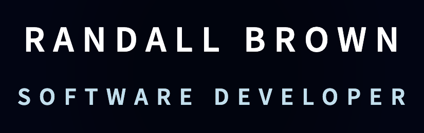
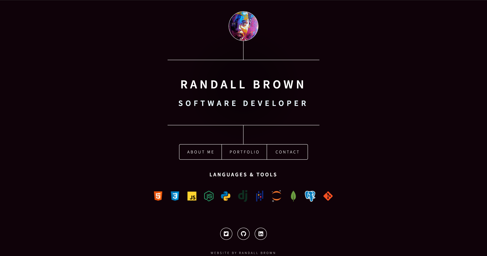

<!-- PROJECT LOGO -->

  

### Hosted On

<h1 align="center">My Portfolio v1</h1>

<h3 align="center"><a href="https://rjbrown.dev/" target="_blank" rel="noreferrer noopener">View Live</a></h3>

<!-- SCREENSHOT -->

  

## Built With

  

## Summary

Welcome to my personal portfolio website! I wanted to have a central location for potential clients, collaborators, or employers to learn about me and connect. Working on changing the page design, moving elements around to be responsive and making things interactive was a fun creative challenge!

### Core Concepts

- Box Model
- Positioning HTML Elements
- CSS Selectors & Specificity
- CSS Animations (Keyframes)
- Form Validation
- Deployment (Netlify)

## Lessons Learned

My goal for this project was to gain a foundational understanding of semantic HTML structure and experiment with as many CSS styles as possible to build my skills. It really changed the way I view the web, now I can't help noticing cool animations on different websites (the YouTube like & subscribe button animations are 🔥)! I definitely plan to continue learning about more advanced CSS styles and tools like SASS and TailwindCSS.

Built using Dimension by @ajlkn | [HTML5 UP](html5up.net)

Free for personal and commercial use under the [CCA 3.0 license](html5up.net/license)
