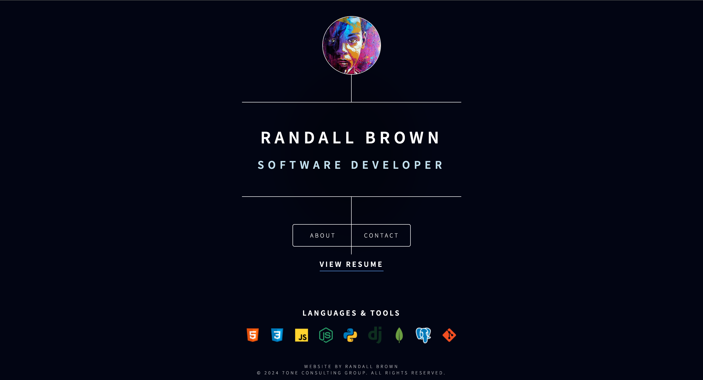

<!-- PROJECT LOGO -->

  
<h1 align="center">My Portfolio v1</h1>
  <h3 align="center">
    <a href="project.url" target="_blank" rel="noreferrer noopener">View Live</a>
  </h3>
  <h2></h2>

<!-- SCREENSHOT -->

  

## Built With

  

## Lessons Learned

- Box Model
- Positioning HTML Elements
- CSS Selectors & Specificity
- CSS Animations (Keyframes)

My goal for this project was to understand semantic HTML structure and experiment with as many CSS styles as possible. It really changed the way I view the web, I can't help noticing cool animations on different websites (the YouTube like & subscribe button animations are 🔥)! I definitely plan to continue learning about more advanced CSS styles and features.

Built using Dimension by [HTML5 UP](html5up.net) | @ajlkn

Free for personal and commercial use under the [CCA 3.0 license](html5up.net/license)
